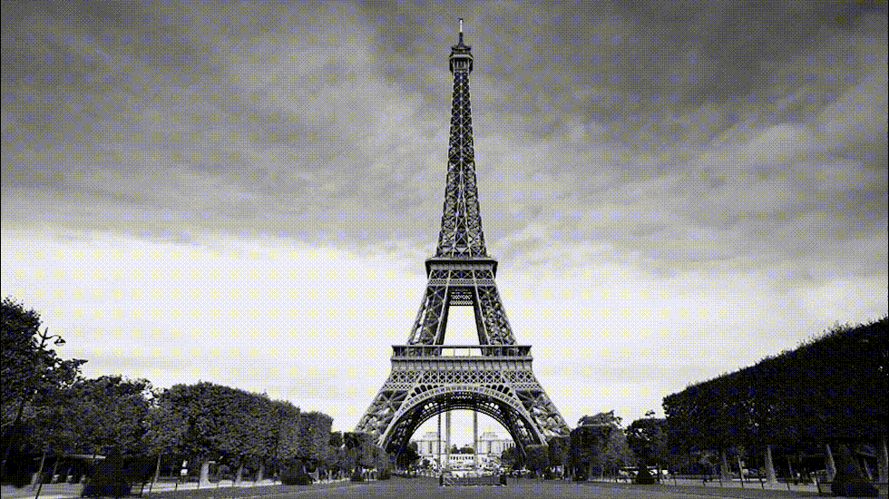

# Canny Edge Detector
This program allows you to input a .bmp image and then detect edges in the image using three parameters: sigma, high 
threshold and low threshold. Included in the program folder are several bitmap images to use with this program:
- ang2.bmp
- cameraman.bmp
- dog.bmp
- steamengine.bmp

Alternatively, you can use your own .bmp images.

## How to run
To read an image, submit the full file path as filename, like this:

C:\Users\Default\image.bmp

In order to obtain a good result, the right values for the three parameters need to be found.

SIGMA: The sigma determines the intensity of the blur that is applied to the image (this filters noise and unwanted 
edges).
    < 1: Use a sigma smaller than 1 for images with no noise.
    1-2: Use a sigma between 1 and 2 for images with average noise.
    > 2: Use a sigma larger than 2 for images with a lot of noise.

HIGH THRESHOLD: Pixels above this value are considered part of an edge. The program gives you information about the 
minimum, maximum and average pixel value in the image. This can be used to determine the high threshold. This is done 
iteratively. The purpose of the high threshold is suppressing any false edges that are still detected. A good result is
when (almost) all false edges are gone and parts of the true edges are still present.

LOW THRESHOLD: Pixels below this value are definetely not part of an edge. Pixels between low and high MIGHT be part of 
an edge, if they are someway connected to a true edge pixel. When determining the high threshold, set the low threshold
equal to the high threshold at first. Afterwards, try a low threshold lower than the high threshold until all edges are 
fully displayed.

Tip: for ang2.bmp, try the following values: sigma = 2, high threshold = 10, low threshold = 0.5.

Tip: larger sigma means larger kernel size which means longer processing time!

## Result

